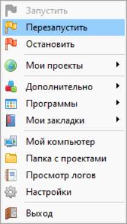

# Установка проекта
## Необходимое ПО:
 + OpenServer
 + PHPStorm
 + Composer
## 1. Подготовка сервера:
 Предполагается использование OpenServer с следующими настройками: 
  + PHP 8.1
  + MqSQL 5.7
  + Apache_2.4
## 2. Подготовка базы данных:
  + Открыть консоль OpenServer: Дополнительно->Консоль
  + Запустить клиент MySQL: 
  > mysql -u root -p
  + Если требуется указываем пароль (по умолчанию пустой)
  + Создаем БД:
  > CREATE DATABASE dev;

  > USE dev;

  + Создаем пользователя:
  > CREATE USER 'user'@'localhost' IDENTIFIED BY 'password';

  > GRANT ALL PRIVILEGES ON dev.* TO 'user'@'localhost'; 


## 3. Настройка PHPStorm:
  Добавляем datasource для MqSQL:
  + **Host**: localhost
  + **User**: User
  + **Password**: password
  + **Database**: dev

## 4. Настройка Проекта:
  + Проинициализировать composer при помощи команды:
  > composer install
  + Поместить проект в OSPanel/domains
  + Создаем файл `local-config.php` в директории проекта `/config` со следующим содержимым:
```php
    return [
    'DB_HOST' => '127.0.0.1',
    'DB_USER' => 'user',
    'DB_PASSWORD' => 'password',
    'DB_NAME' =>'dev',
     ];
```
  + Открыть OpenServer -> Настройки -> Домены -> ввести произвольное имя домена
  + В качестве папки домена указать папку `/public` данного проекта
  + Перезапустить OpenServer  
  
  + Затем зайти во вкладку Мои проекты с помощью окна OpenServer и выбрать указанный домен

## 5. Заключение:
+ Если все пункты были выполнены верно,то вы увидите главную страницу магазина:


## 6. Примечание:
+ Если в будущем будет необходимость очистить базу данных, то сначала удалите файл
`config/dbtime-config.txt`, а затем запустите `uninstall/uninstall-structure.sql`